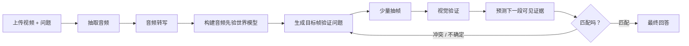

# Audio-First Video Understanding Agent

一个本地优先的视频理解工作台：上传短视频并输入问题后，系统会先理解音频，构建“盲人视角”的事件假设，再用少量目标关键帧验证或推翻这些假设，最后生成带时间戳证据的视频问答总结。

这个项目的重点不是“均匀抽帧再逐帧看”，而是一个有目的的 agent loop：



## 核心能力

- 音频优先：优先用音频转写形成时间线、人物、环境、情绪和视觉假设。
- 目标帧验证：每一帧都带有一个明确的验证目标，例如“是否出现红盖头/婚礼动作”。
- 局部回看：预测失败或证据不确定时，只在相关时间窗二分式补帧。
- LangGraph 工作流：用 `StateGraph` 串起 ingest、audio、vision、prediction、verification、synthesis。
- 本地优先存储：视频、音频、帧、状态和 SQLite 都保存在本地 `data/`，默认不上传到仓库。
- 可降级转写：API 转写不可用时，可使用本地 faster-whisper 模型。
- Web 工作台：React/Vite 前端展示进度、音频时间线、关键帧证据、预测验证和最终答案。

## 技术栈

- 后端：Python、FastAPI、LangGraph、SQLite
- 前端：React、Vite、TypeScript、Lucide Icons
- 多媒体处理：FFmpeg / ffprobe
- 模型接口：OpenAI-compatible API
- 本地音频兜底：faster-whisper

## 目录结构

```text
audio_first_video_agent/
  backend/
    app/
      ai.py             # 模型调用、转写、视觉观察、总结
      workflow.py       # LangGraph 工作流
      keyframes.py      # 音频引导的目标抽帧策略
      prediction.py     # 预测验证分类
      video.py          # FFmpeg / ffprobe 封装
      storage.py        # SQLite 和 state.json 存储
    tests/
  frontend/
    src/
      App.tsx
      styles.css
  scripts/
    start_backend.ps1
    start_frontend.ps1
  .env.example
  README.md
```

运行时数据会写入：

```text
data/uploads/{job_id}/source.mp4
data/jobs/{job_id}/audio.wav
data/jobs/{job_id}/frames/*.jpg
data/jobs/{job_id}/state.json
data/app.db
```

`data/`、`.env`、模型权重、上传视频和 SQLite 数据库已被 `.gitignore` 排除。

## 快速开始

### 1. 安装依赖

准备：

- Python 3.11+
- Node.js 20+
- pnpm
- FFmpeg / ffprobe

后端：

```powershell
cd audio_first_video_agent
python -m venv .venv
.\.venv\Scripts\Activate.ps1
pip install -r backend\requirements.txt
copy .env.example .env
```

前端：

```powershell
cd frontend
pnpm install
```

### 2. 配置模型

编辑根目录 `.env`：

```env
OPENAI_API_KEY=你的_API_KEY
OPENAI_BASE_URL=https://your-openai-compatible-endpoint/v1
AUDIO_FIRST_MOCK_MODE=false

VISION_MODEL=gpt-5.4
REASONING_MODEL=gpt-5.4
REASONING_EFFORT=low

LOCAL_TRANSCRIBE_FALLBACK=true
LOCAL_TRANSCRIBE_MODEL=data/models/faster-whisper-base
MAX_KEYFRAMES=6
LLM_TIMEOUT_SECONDS=90
LLM_MAX_RETRIES=1
```

如果没有可用 API，可以把 `AUDIO_FIRST_MOCK_MODE=true` 用于验证流程和界面。

### 3. 启动服务

方式一：脚本启动。

```powershell
# terminal 1
.\scripts\start_backend.ps1

# terminal 2
.\scripts\start_frontend.ps1
```

方式二：手动启动。

```powershell
# backend
$env:PYTHONPATH="backend"
python -m uvicorn app.main:app --app-dir backend --host 127.0.0.1 --port 8000

# frontend
cd frontend
pnpm dev
```

打开：

[http://127.0.0.1:5173/](http://127.0.0.1:5173/)

## API

- `POST /api/jobs`：上传视频和问题，返回 `job_id`
- `GET /api/jobs/{job_id}`：查询状态、进度、当前节点和错误
- `GET /api/jobs/{job_id}/events`：SSE 进度流
- `GET /api/jobs/{job_id}/result`：查询最终答案、时间线、关键帧和预测验证
- `GET /api/jobs/{job_id}/frames/{filename}`：读取抽取的帧图片

## Agent 工作流

1. `ingest_video`：读取视频时长、fps、分辨率和音频轨。
2. `extract_audio`：抽取 16kHz mono WAV。
3. `transcribe_audio`：优先 API 转写，失败时使用本地 faster-whisper。
4. `build_audio_world_model`：只根据音频构建事件时间线和可验证视觉假设。
5. `plan_keyframes`：把音频事件变成目标帧验证问题，并在预算内选择少量帧。
6. `extract_keyframes`：用 FFmpeg 抽帧，避开视频末尾不可抽取边界。
7. `observe_frames`：逐帧回答“这一帧是否验证音频假设”。
8. `predict_next_events`：预测后续可验证的视觉证据。
9. `verify_predictions`：判定 match / conflict / uncertain。
10. 若冲突或高不确定，回到 `plan_keyframes` 只加密相关窗口。
11. `synthesize_answer`：生成最终中文总结，附证据和未确认点。

## 测试

后端单元测试：

```powershell
$env:PYTHONPATH="backend"
python -m pytest backend\tests -q
```

前端构建：

```powershell
cd frontend
pnpm build
```

当前覆盖重点：

- 音频引导抽帧和去重。
- 预算帧数下保留关键后段证据。
- 不抽视频精确末尾帧。
- 预测验证的 match / conflict / uncertain。
- LangGraph mock 流程完整跑通。
- 不确定预测触发局部 refinement。

## 已知限制

- v1 是产品原型，不做论文级 benchmark。
- 当前主要处理本地上传视频，不包含用户权限、云存储和队列系统。
- 视频视觉理解仍依赖逐帧图像模型调用，慢速模型会影响 70% 的观察阶段。
- 直接视频多模态模型可以作为旁路全局视觉扫描，但当前主线仍是“音频先验 + 目标帧验证”。
- 若代理 API 不支持音频接口，转写会使用本地 faster-whisper fallback。

## GitHub 发布注意

发布前确认不要提交：

- `.env`
- `data/`
- `frontend/node_modules/`
- `frontend/dist/`
- 本地视频、音频、关键帧、SQLite 数据库
- 本地 faster-whisper 模型权重

这些路径已经在 `.gitignore` 中排除。
