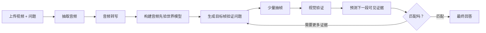

# Audio-First Video Understanding Agent

一个本地优先的视频理解工作台：上传视频或输入视频 URL 并提问后，系统会先理解音频，构建“盲人视角”的事件假设，再用少量目标关键帧验证这些假设，最后生成带时间戳证据的视频问答总结。完成后也可以继续多轮追问。

这个项目的重点不是“均匀抽帧再逐帧看”，而是一个有目的的 agent loop：



## 核心能力

- 音频优先：优先用音频转写形成时间线、人物、环境、情绪和视觉假设。
- 目标帧验证：每一帧都带有一个明确的验证目标，例如“是否出现红盖头/婚礼动作”。
- 局部回看：预测失败或证据不确定时，只在相关时间窗二分式补帧。
- LangGraph 工作流：用 `StateGraph` 串起 ingest、audio、vision、prediction、verification、synthesis。
- 本地优先存储：视频、音频、帧、状态和 SQLite 都保存在本地 `data/`，默认不上传到仓库。
- 可降级转写：API 转写不可用时，可使用本地 faster-whisper 模型。
- Web 工作台：React/Vite 前端展示进度、音频时间线、关键帧证据、覆盖情况、最终答案和多轮追问。
- 直播分析：直播 URL 或 m3u8/flv 直链会进入独立 Live Session，按短窗口实时切片、转写、抽关键帧并推送分段总结。
- URL 输入：直链 mp4/webm/mov 可直接下载；站点页面链接可通过 `yt-dlp` 下载后进入同一条分析链路。

## 技术栈

- 后端：Python、FastAPI、LangGraph、SQLite
- 前端：React、Vite、TypeScript、Lucide Icons
- 多媒体处理：FFmpeg / ffprobe
- 模型接口：OpenAI-compatible API
- 本地音频兜底：faster-whisper
- URL 下载：httpx / yt-dlp

## 目录结构

```text
audio_first_video_agent/
  backend/
    app/
      ai.py             # 模型调用、转写、视觉观察、总结
      workflow.py       # LangGraph 工作流
      keyframes.py      # 音频引导的目标抽帧策略
      prediction.py     # 预测验证分类
      video.py          # FFmpeg / ffprobe 封装
      storage.py        # SQLite 和 state.json 存储
    tests/
  frontend/
    src/
      App.tsx
      styles.css
  scripts/
    start_backend.ps1
    start_frontend.ps1
  .env.example
  README.md
```

运行时数据会写入：

```text
data/uploads/{job_id}/source.mp4
data/jobs/{job_id}/audio.wav
data/jobs/{job_id}/frames/*.jpg
data/jobs/{job_id}/state.json
data/app.db
```

`data/`、`.env`、模型权重、上传视频和 SQLite 数据库已被 `.gitignore` 排除。

## 快速开始

### 1. 安装依赖

准备：

- Python 3.11+
- Node.js 20+
- pnpm
- FFmpeg / ffprobe

后端：

```powershell
cd audio_first_video_agent
python -m venv .venv
.\.venv\Scripts\Activate.ps1
pip install -r backend\requirements.txt
copy .env.example .env
```

前端：

```powershell
cd frontend
pnpm install
```

### 2. 配置模型

编辑根目录 `.env`：

```env
OPENAI_API_KEY=你的_API_KEY
OPENAI_BASE_URL=https://your-openai-compatible-endpoint/v1
AUDIO_FIRST_MOCK_MODE=false
AUDIO_FIRST_FAST_MODE=false

VISION_MODEL=gpt-5.4
REASONING_MODEL=gpt-5.4
REASONING_EFFORT=low

# 可选：把本地 JoyAI-VL-Interaction 用作高速视觉验证器。
# openai = 使用 VISION_MODEL；joyai = 使用本地 JoyAI adapter；auto = 先试 JoyAI，失败再回退到 VISION_MODEL。
VISION_PROVIDER=openai
JOYAI_API_BASE=http://127.0.0.1:8070/v1
JOYAI_API_KEY=EMPTY
JOYAI_MODEL=JoyAI-VL-Interaction-Preview
JOYAI_TIMEOUT_SECONDS=30

LOCAL_TRANSCRIBE_FALLBACK=true
LOCAL_TRANSCRIBE_MODEL=data/models/faster-whisper-base
MAX_KEYFRAMES=6
LLM_TIMEOUT_SECONDS=90
LLM_MAX_RETRIES=1
```

如果没有可用 API，可以把 `AUDIO_FIRST_MOCK_MODE=true` 用于验证流程和界面。

如果要启用 JoyAI 组合模式，先启动 JoyAI 的 vLLM 主服务和 `live_adapter.py`，确认 `http://127.0.0.1:8070/health` 返回 200，然后把 `VISION_PROVIDER=joyai`。此时 agent 仍然用音频转写和世界模型决定“该看哪里”，但目标帧视觉验证会交给本地 JoyAI，适合低延迟检查红布、囍字、人物动作、场景变化等可见证据。

如果要优先速度，可以再设置 `AUDIO_FIRST_FAST_MODE=true`。快速模式会跳过耗时的大模型预测、验证和最终总结调用，改用本地启发式生成音频时间线、覆盖检查和中文答案；适合短视频快速质检，但细节推理会比完整模式粗一些。长视频下建议同时设置 `FAST_MAX_KEYFRAMES=12`、`FAST_SECONDS_PER_FRAME=120`，让 17 分钟级视频自动扩展到约 9 个关键画面，而不是固定只看 4 帧。

### 3. 启动服务

方式一：脚本启动。

```powershell
# terminal 1
.\scripts\start_backend.ps1

# terminal 2
.\scripts\start_frontend.ps1
```

方式二：手动启动。

```powershell
# backend
$env:PYTHONPATH="backend"
python -m uvicorn app.main:app --app-dir backend --host 127.0.0.1 --port 8000

# frontend
cd frontend
pnpm dev
```

打开：

[http://127.0.0.1:5173/](http://127.0.0.1:5173/)

## API

- `POST /api/jobs`：上传视频和问题，返回 `job_id`
- `POST /api/jobs/url`：传入 `{url, question}`，下载视频后创建同样的分析任务
- `GET /api/jobs/{job_id}`：查询状态、进度、当前节点和错误
- `GET /api/jobs/{job_id}/events`：SSE 进度流
- `GET /api/jobs/{job_id}/partial`：查询已完成的音频、关键画面和观察结果，用于前端实时展示
- `GET /api/jobs/{job_id}/result`：查询最终答案、时间线、关键帧和覆盖情况
- `POST /api/jobs/{job_id}/ask`：基于已保存 state/result 继续追问
- `GET /api/jobs/{job_id}/frames/{filename}`：读取抽取的帧图片
- `GET /api/jobs/{job_id}/source`：读取上传或下载后的源视频，用于前端预览
- `POST /api/live/sessions`：创建直播分析 session，支持 `{url, question, window_seconds, max_segments}`
- `GET /api/live/sessions/{session_id}`：查询直播 session 当前状态和分段结果
- `GET /api/live/sessions/{session_id}/events`：SSE 实时推送直播分段总结
- `POST /api/live/sessions/{session_id}/stop`：停止直播分析
- `GET /api/live/{session_id}/frames/{filename}`：读取直播短窗口关键帧

## 直播分析

直播分析和上传视频分析是两条独立链路。上传视频会跑完整 LangGraph job；直播分析更像一个持续运行的采样器：

1. 解析直播 URL。直链 `m3u8/flv/mp4` 直接使用；抖音直播页面会尝试从 HTML 中提取 `hls_pull_url` / `flv_pull_url`。
2. FFmpeg 每 `LIVE_WINDOW_SECONDS` 秒捕获一个短视频窗口。
3. 每个窗口抽音频、转写、抽中点关键帧。
4. 用 JoyAI 或当前视觉模型观察该关键帧。
5. 通过 SSE 把该段的音频、画面证据和一句实时总结推到前端。

配置项：

```env
LIVE_WINDOW_SECONDS=4
LIVE_MAX_SEGMENTS=0
LIVE_SEGMENT_TIMEOUT_SECONDS=18
```

`LIVE_MAX_SEGMENTS=0` 表示持续分析；调试时可以在前端填 `1` 或 `3`，先快速验证直播流是否可解析。实测 `https://live.douyin.com/547977714661` 能解析出 HLS 并完成 3 秒窗口分析：端到端约 8.8 秒，包含本地 faster-whisper 转写和 JoyAI 关键帧观察。若某个直播间需要登录态或 cookie，可粘贴已经获取到的 m3u8/flv 直链。

## Agent 工作流

1. `ingest_video`：读取视频时长、fps、分辨率和音频轨。
2. `extract_audio`：抽取 16kHz mono WAV。
3. `transcribe_audio`：优先 API 转写，失败时使用本地 faster-whisper。
4. `build_audio_world_model`：只根据音频构建事件时间线和可验证视觉假设。
5. `generate_frame_candidates`：在音频事件窗口内抽取低分辨率分析帧，用亮度变化、average hash、边缘密度和事件类型生成低成本候选帧。
6. `plan_keyframes`：把音频事件变成目标帧验证问题，融合候选帧，并在预算内选择少量帧。
7. `extract_keyframes`：用 FFmpeg 抽帧，避开视频末尾不可抽取边界。
8. `observe_frames`：批量多图回答“这一帧是否验证音频假设”。
9. `predict_next_events`：预测后续可验证的视觉证据。
10. `verify_predictions`：内部判定 match / conflict / uncertain，并转化为用户可读的覆盖情况。
11. 若需要更多证据，回到 `plan_keyframes` 对相关窗口做二分式补帧。
12. `synthesize_answer`：生成最终中文总结，附证据和未确认点。

## 迭代实验

本仓库包含一个可复现实验脚本，用同一视频对比旧策略和增强策略：

```powershell
$env:PYTHONPATH="backend"
python scripts\benchmark_agent.py --video "C:\path\to\sample.mp4" --output data\benchmarks\latest.json
```

当前增强策略包括：

- 音频窗口内的低成本候选帧扫描，先用本地视觉特征筛出可能有证据的帧。
- 事件类型感知打分，例如婚礼/结尾更偏向音频事件后段，身份确认更偏向中后段。
- 初始 enhanced 预算默认压到 `ENHANCED_INITIAL_KEYFRAMES=4`，把剩余预算留给预测误差回看。
- 回看默认 `REFINEMENT_SAMPLES_PER_WINDOW=1`，每个需要更多证据的窗口只取一个二分中点。
- `VISION_BATCH_SIZE=3`，一次视觉请求观察多张图，减少模型调度和网络往返。

在当前样例视频上，最终一次实测结果如下。这里的准确率是针对已知关键事实的代理质量分，不是论文级数据集指标。

| 策略 | 耗时 | 观察帧 | 视觉请求 | 代理质量分 | 关键结果 |
| --- | ---: | ---: | ---: | ---: | --- |
| legacy | 142.94s | 8 | 3 | 5/5 | 识别出救狐相认、婚礼、山林结尾证据不足 |
| enhanced | 151.06s | 7 | 3 | 5/5 | 少看 1 帧，保留同等关键事实和不确定性判断 |

接入 JoyAI 本地视觉验证器后，同一视频、同样 enhanced 抽帧策略的实测对比如下：

| 视觉验证器 | 耗时 | 观察帧 | 视觉请求 | 代理质量分 | 关键结果 |
| --- | ---: | ---: | ---: | ---: | --- |
| OpenAI-compatible `VISION_MODEL=gpt-5.4` | 131.56s | 4 | 2 | 5/5 | 识别出白狐相认、成婚、幸福生活旁白证据偏弱 |
| JoyAI local adapter | 69.47s | 4 | 4 | 5/5 | 保持同等关键事实，完整流程约快 47%，约 1.9x |
| JoyAI local adapter + `AUDIO_FIRST_FAST_MODE=true` | 10.27s | 4 | 4 | 5/5 | 跳过大模型预测/验证/总结，保留音频定位和 JoyAI 目标帧证据，答案更模板化 |

这里 JoyAI 的请求数更高，是因为当前实现逐帧调用本地 adapter；但本地单帧延迟低，整体仍明显更快。这个组合验证了当前方向：音频和问题负责缩小注意力范围，JoyAI 负责快速确认目标帧证据。

快速模式的节点级 profile 显示，10 秒样例视频的主要耗时已经变为本地转写、候选帧扫描和 JoyAI 观察帧：`transcribe_audio` 约 3.5s，`generate_frame_candidates` 约 2.8s，`observe_frames` 约 2.9s，其余推理节点基本为 0s。

17 分 33 秒的 Bilibili 长视频样例也已跑通：`AUDIO_FIRST_FAST_MODE=true` + JoyAI local adapter 完整耗时约 90s，旧配置只抽取 4 个目标帧。现在快速模式支持按时长自适应关键帧预算，默认 `FAST_SECONDS_PER_FRAME=120`、`FAST_MAX_KEYFRAMES=12`，这类 17 分钟视频会规划约 9 个关键画面。节点 profile 显示旧配置下 `transcribe_audio` 本地 faster-whisper 占约 77s，候选帧扫描约 6s，JoyAI 观察约 3.8s；因此长视频的主要瓶颈已经转为全量音频转写。

中间实验里，enhanced 虽已使用批量视觉请求，但仍因三点回看多观察 4 帧而慢 79%；加入二分式回看后，额外耗时降到 5.68%，同时少观察 1 帧。下一步主要优化空间是缓存候选帧特征、减少候选扫描 FFmpeg 启动次数，以及让验证器在结尾短窗口上更早停止回看。

## 测试

后端单元测试：

```powershell
$env:PYTHONPATH="backend"
python -m pytest backend\tests -q
```

前端构建：

```powershell
cd frontend
pnpm build
```

当前覆盖重点：

- 音频引导抽帧和去重。
- 预算帧数下保留关键后段证据。
- 不抽视频精确末尾帧。
- enhanced 候选帧分类、候选 probe 和二分式 refinement。
- 预测验证的 match / conflict / uncertain。
- LangGraph mock 流程完整跑通。
- 不确定预测触发局部 refinement。

## 已知限制

- v1 是产品原型，不做论文级 benchmark。
- 当前主要处理本地上传视频，不包含用户权限、云存储和队列系统。
- 视频视觉理解仍依赖图像模型调用；当前已支持批量多图观察，但慢速模型仍会影响观察阶段。
- 直接视频多模态模型可以作为旁路全局视觉扫描，但当前主线仍是“音频先验 + 目标帧验证”。
- 若代理 API 不支持音频接口，转写会使用本地 faster-whisper fallback。

## GitHub 发布注意

发布前确认不要提交：

- `.env`
- `data/`
- `frontend/node_modules/`
- `frontend/dist/`
- 本地视频、音频、关键帧、SQLite 数据库
- 本地 faster-whisper 模型权重

这些路径已经在 `.gitignore` 中排除。
