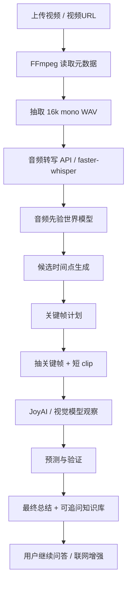

# Audio-First Video Understanding Agent

一个本地优先的视频/直播理解工作台。它不是把视频均匀切成一堆帧再逐帧看，而是先理解音频，构建“盲人视角”的事件时间线，再用少量音频引导的短视频 clip 验证关键画面，最后把视频内容变成可追问的问答知识库。

当前主方案是：**音频转写 + 世界模型 + 目标短 clip + 多轮问答**。实测下来，直接把整段长视频丢给多模态模型虽然很快，但长视频细节和时间线不稳定；短 clip 更适合作为可靠的视频记忆单元。

## 主要能力

- 上传本地视频，或输入视频页面/直链 URL 后自动解析。
- 支持常见页面 URL：抖音、B 站、YouTube 等通过 `yt-dlp` 下载后分析；直链 `mp4/webm/mov/m3u8/flv` 直接处理。
- 类抖音“问 AI”模式：解析完成后默认生成当前视频总结、高光片段和推荐问题，用户无需先想好问题。
- 音频优先分析：抽取音频、转写、生成事件时间线和可验证视觉假设。
- JoyAI 短 clip 视觉理解：默认抽 2-4 秒局部视频片段给 JoyAI `video_url`，比单帧更能看出动作、切换、样片和上下文。
- 多轮追问：视频解析完成后，用户可以继续问总结、时间点、产品对比、购买建议、具体画面等问题。
- 联网增强：追问时可选择联网搜索，把视频知识库和外部资料结合回答。
- 直播合规监控：直播 URL 可进入独立监控链路，只在发现违禁词、粗口、擦边、抽烟等风险时保留证据。
- 本地优先存储：源视频、音频、关键帧、状态、SQLite 都写入本地 `data/`，默认不提交到 Git。
- 可复现实测：内置 benchmark 脚本，可对比单帧、短 clip、整段粗扫的速度和准确性。

## 架构



LangGraph 节点：

1. `ingest_video`：读取时长、fps、分辨率、音频轨。
2. `extract_audio`：抽取 16kHz mono WAV。
3. `transcribe_audio`：API 转写，失败时可走本地 faster-whisper。
4. `build_audio_world_model`：根据音频构建时间线、人物、场景、情绪和待验证视觉证据。
5. `generate_frame_candidates`：用低成本分析帧生成候选点。
6. `plan_keyframes`：结合用户问题和音频事件选择少量关键时间点。
7. `extract_keyframes`：抽关键帧。
8. `observe_frames`：默认对静态视频抽短 clip 给 JoyAI；直播合规仍走单帧审核。
9. `predict_next_events`：生成可验证的短假设。
10. `verify_predictions`：判断 match / conflict / uncertain，必要时局部补采样。
11. `synthesize_answer`：生成最终回答、AI 默认摘要卡和后续问答知识库。

## 为什么使用短 clip

我们实测了两条视频：

- 17 分钟 3D 打印装修长视频。
- 约 12 分钟 Pocket 4P 评测视频。

测试 8 个音频引导关键时间点，比较单帧、2 秒 clip、4 秒 clip、8 秒 clip、低分辨率 clip、带音频 clip、整段粗扫。

| 方案 | 平均耗时 | 平均命中分 | 通过率 | 结论 |
|---|---:|---:|---:|---|
| 单帧 640 | 1.415s | 0.833 | 62.5% | 快，但容易漏掉过程和上下文 |
| 2 秒 clip 640 | 2.152s | 1.000 | 100% | 很稳，成本低 |
| 4 秒 clip 640 | 2.164s | 1.000 | 100% | 当前默认主方案 |
| 8 秒 clip 640 | 2.135s | 0.875 | 75% | 上下文太多，偶尔跑偏 |
| 4 秒 clip 320 | 1.593s | 0.917 | 75% | 更快，但文字/细节下降 |
| 4 秒 clip 640 + 音频 | 1.405s | 0.833 | 75% | 不比“外部音频转写 + prompt”稳定 |
| 整段 320p/1fps 粗扫 | 编码 3.145s + 模型 2.195s | 0.666 | - | 能看主题，不适合做主记忆 |

结论：

- 静态证据点用 2 秒 clip 足够快。
- 动作、样片、动态范围、长焦切换、稳定性等问题用 4 秒 clip 更稳。
- 8 秒 clip 不适合默认，因为容易引入无关上下文。
- 整段直塞模型只能作为粗扫，不适合作为视频问答知识库。

默认配置已经启用自适应短 clip：静态检查自动用 2 秒，时间过程类检查用 `JOYAI_CLIP_SECONDS`。

更完整的方法对比见：[AI 看视频方法对比](docs/method_comparison.md)。这份文档把当前常见路线拆成均匀抽帧、场景切分、高密度抽帧、整段视频直塞、ASR-only、视频 RAG、流式模型和本项目的音频优先短 clip，并从 Temporal Recall、Evidence Hit Score、视觉预算、延迟、载荷、可回溯性等指标对比。

本轮最关键的采样效率数据：

- 两条视频总时长 1815 秒，8 个关键 probe 点。
- 均匀 12 帧/视频在 +/-4 秒内只命中 1/8 个关键点，Temporal Recall 为 12.5%。
- 若均匀采样要保证 +/-4 秒覆盖，约需 228 帧；保证 +/-2 秒覆盖，约需 455 帧。
- 本项目的 4 秒短 clip 只看 32 秒，占总时长 1.76%，但 8 个 probe 点全部命中，平均命中分 1.000。
- 如果按当前多模态视频模型常见的整段内部采样估算，整段 0.5fps / 1fps / 2fps 分别约需 908 / 1816 / 3631 个视觉帧单位；本项目 4 秒短 clip 只需 32 个视觉帧单位，视觉 token 等价开销约减少 96.5% / 98.2% / 99.1%。在这组实测里，整段粗扫平均命中分为 0.666，而短 clip 为 1.000。

## 技术栈

- 后端：Python、FastAPI、LangGraph、SQLite。
- 前端：React、Vite、TypeScript、Lucide Icons。
- 多媒体：FFmpeg / ffprobe、yt-dlp。
- 模型：OpenAI-compatible API、JoyAI-VL-Interaction、本地 faster-whisper fallback。
- 存储：本地文件系统 + SQLite + `state.json` checkpoint。

## 目录结构

```text
audio_first_video_agent/
  backend/
    app/
      ai.py             # 模型调用、转写、视觉观察、追问回答
      workflow.py       # LangGraph 工作流
      keyframes.py      # 音频引导抽帧策略
      candidates.py     # 低成本候选帧扫描
      live.py           # 直播合规监控
      main.py           # FastAPI 路由
      video.py          # FFmpeg / ffprobe 封装
      web_search.py     # 联网搜索增强
      storage.py        # SQLite 和 state.json 存储
    tests/
  frontend/
    src/
      App.tsx
      styles.css
  scripts/
    benchmark_multidim.py
    start_backend.ps1
    start_frontend.ps1
  .env.example
  README.md
```

运行时数据：

```text
data/uploads/{job_id}/source.mp4
data/jobs/{job_id}/audio.wav
data/jobs/{job_id}/frames/*.jpg
data/jobs/{job_id}/state.json
data/app.db
```

`data/`、`.env`、上传视频、SQLite、模型权重都已被 `.gitignore` 排除。

## 快速开始

### 1. 安装依赖

需要：

- Python 3.11+
- Node.js 20+
- pnpm
- FFmpeg / ffprobe

后端：

```powershell
cd audio_first_video_agent
python -m venv .venv
.\.venv\Scripts\Activate.ps1
pip install -r backend\requirements.txt
copy .env.example .env
```

前端：

```powershell
cd frontend
pnpm install
```

### 2. 配置 `.env`

最小 OpenAI-compatible 配置：

```env
OPENAI_API_KEY=你的_API_KEY
OPENAI_BASE_URL=https://your-openai-compatible-endpoint/v1
AUDIO_FIRST_MOCK_MODE=false
AUDIO_FIRST_FAST_MODE=true

TRANSCRIBE_MODEL=gpt-4o-transcribe
TRANSCRIBE_FALLBACK_MODEL=gpt-4o-transcribe
REASONING_MODEL=gpt-5.4
REASONING_EFFORT=low
FOLLOWUP_MODEL=gpt-5.4

VISION_PROVIDER=openai
VISION_MODEL=gpt-5.4
```

使用本地 JoyAI 做短 clip 视觉理解：

```env
VISION_PROVIDER=joyai
JOYAI_API_BASE=http://127.0.0.1:8070/v1
JOYAI_API_KEY=EMPTY
JOYAI_MODEL=JoyAI-VL-Interaction-Preview
JOYAI_TIMEOUT_SECONDS=30
JOYAI_INPUT_MODE=clips
JOYAI_CLIP_SECONDS=4
JOYAI_ADAPTIVE_CLIP_SECONDS=true
JOYAI_CLIP_WIDTH=640
JOYAI_MAX_CLIPS_PER_JOB=4
```

本地转写兜底：

```env
LOCAL_TRANSCRIBE_FALLBACK=true
LOCAL_TRANSCRIBE_FIRST=false
LOCAL_TRANSCRIBE_MODEL=data/models/faster-whisper-base
```

长视频建议：

```env
MIN_VIDEO_SECONDS=0
MAX_VIDEO_SECONDS=0
FAST_MAX_KEYFRAMES=12
FAST_SECONDS_PER_FRAME=120
FAST_MAX_TIMELINE_EVENTS=12
```

没有 API 时，可设置：

```env
AUDIO_FIRST_MOCK_MODE=true
```

### 3. 启动

脚本启动：

```powershell
# terminal 1
.\scripts\start_backend.ps1

# terminal 2
.\scripts\start_frontend.ps1
```

手动启动：

```powershell
$env:PYTHONPATH="backend"
python -m uvicorn app.main:app --app-dir backend --host 127.0.0.1 --port 8000 --reload

cd frontend
pnpm dev --host 127.0.0.1
```

打开：[http://127.0.0.1:5173/](http://127.0.0.1:5173/)

## 页面交互

前端现在是一个类抖音的“问 AI”工作台：

- 桌面端左侧是视频/直播播放区，右侧是固定的 `问AI` 面板；移动端自动变成上视频、下问答。
- 上传视频或粘贴视频 URL 后，后台立即解析；解析完成时 AI 会主动发送“总结当前视频内容”卡片。
- 默认卡片包含三类内容：简洁总结、可点击高光片段、推荐追问。
- 点击高光时间点会直接跳转到对应视频位置播放。
- 点击推荐问题会直接发起追问，例如“相比上一代有哪些升级？”、“推荐买哪一代？”。
- 用户追问时，默认只用视频知识库；打开联网后，会把外部搜索结果作为补充。
- 直播模式仍然先询问用户需要监控什么，再进入实时扫描。

## API

- `POST /api/jobs`：上传视频，返回 `job_id`。
- `POST /api/jobs/url`：传入 `{url, question}`，下载后进入同一条分析链路。
- `GET /api/jobs/{job_id}`：查询状态、进度、当前节点和错误。
- `GET /api/jobs/{job_id}/events`：SSE 任务进度。
- `GET /api/jobs/{job_id}/partial`：查询已完成的部分结果。
- `GET /api/jobs/{job_id}/result`：查询最终结果。
- `POST /api/jobs/{job_id}/ask`：基于已解析视频继续追问，支持 `use_web_search`。
- `GET /api/jobs/{job_id}/frames/{filename}`：读取关键帧。
- `GET /api/jobs/{job_id}/source`：读取源视频。
- `POST /api/live/sessions`：创建直播合规监控。
- `GET /api/live/sessions/{session_id}`：查询直播监控状态。
- `GET /api/live/sessions/{session_id}/events`：SSE 直播监控事件。
- `POST /api/live/sessions/{session_id}/stop`：停止直播监控。
- `GET /api/live/{session_id}/frames/{filename}`：读取风险证据帧。

`/result` 和 `/partial` 会额外返回 `ai_overview`：

```json
{
  "ai_overview": {
    "summary": "默认视频总结",
    "bullets": ["内容要点"],
    "highlights": [
      {
        "time": 475.0,
        "time_label": "7:55",
        "label": "动态范围片段",
        "detail": "ISO1600 动态范围测试"
      }
    ],
    "suggested_questions": ["相比上一代有哪些升级？", "推荐买哪一代？"]
  }
}
```

## URL 下载

直链视频会直接下载。页面链接依赖 `yt-dlp`，例如抖音、B 站、YouTube。

部分抖音页面需要新鲜 cookie：

```env
DOUYIN_COOKIES_FILE=C:\path\to\cookies.txt
YTDLP_COOKIES_FILE=C:\path\to\cookies.txt
YTDLP_COOKIES_FROM_BROWSER=edge
```

如果 `yt-dlp` 报 `Unsupported URL`，通常是该站点 URL 形态未被当前 `yt-dlp` 支持，或需要 cookie/登录态。可以先把网页中的真实 `mp4/m3u8/flv` 链接粘进去。

## 直播合规监控

直播分析和静态视频问答是两条独立链路。直播监控不是持续保存所有画面，而是：

1. 解析直播 URL 或直链。
2. FFmpeg 每 `LIVE_WINDOW_SECONDS` 秒捕获短窗口。
3. 抽音频转写，检查粗口/违禁词。
4. 抽中点帧，检查擦边、抽烟、裸露、暴力、危险行为等可见风险。
5. 正常窗口只计数并删除临时文件；只有命中风险时保留证据。
6. SSE 推送风险和扫描统计。

配置：

```env
LIVE_WINDOW_SECONDS=2
LIVE_MAX_SEGMENTS=0
LIVE_SEGMENT_TIMEOUT_SECONDS=18
LIVE_FAST_CAPTURE=true
LIVE_FRAME_WIDTH=640
```

实测低延迟捕获下，2 秒窗口热启动可以压到约 1.5 秒级，主要耗时来自本地转写和 JoyAI 视觉审核。

## Benchmark

运行多维度实测：

```powershell
python scripts\benchmark_multidim.py
```

从 benchmark 报告生成方法级对比摘要：

```powershell
python scripts\compare_methods_from_benchmark.py data\benchmarks\20260626_162946\report.json
```

只做冒烟：

```powershell
python scripts\benchmark_multidim.py --limit-points 1 --skip-whole
```

输出目录：

```text
data/benchmarks/{run_id}/report.json
data/benchmarks/{run_id}/report.md
```

当前实测结论：

- `clip2_640`：平均 2.152s，命中分 1.000。
- `clip4_640`：平均 2.164s，命中分 1.000。
- `frame_640`：平均 1.415s，命中分 0.833。
- `whole_320p_1fps`：很快但容易丢细节或跑偏，不作为主记忆。

## 测试

后端：

```powershell
$env:PYTHONPATH="backend"
python -m pytest backend\tests -q
```

前端：

```powershell
pnpm --dir frontend build
```

## 已知限制

- 这是产品原型，不是论文级 benchmark。
- 音频转写质量会直接影响时间线和抽 clip 的质量。
- JoyAI 整段长视频输入目前只适合粗扫主题，不适合做可靠细节记忆。
- 页面 URL 解析受 `yt-dlp`、cookie 和目标站反爬策略影响。
- 直播合规监控是规则 + 多模态判断，不等同于平台级审核系统。
- 联网搜索只作为外部资料补充，视频中的观点和证据仍然优先。

## GitHub 发布注意

不要提交：

- `.env`
- `data/`
- `frontend/node_modules/`
- `frontend/dist/`
- 本地视频、音频、关键帧、SQLite 数据库
- 本地 faster-whisper 模型权重

这些路径已在 `.gitignore` 中排除。
